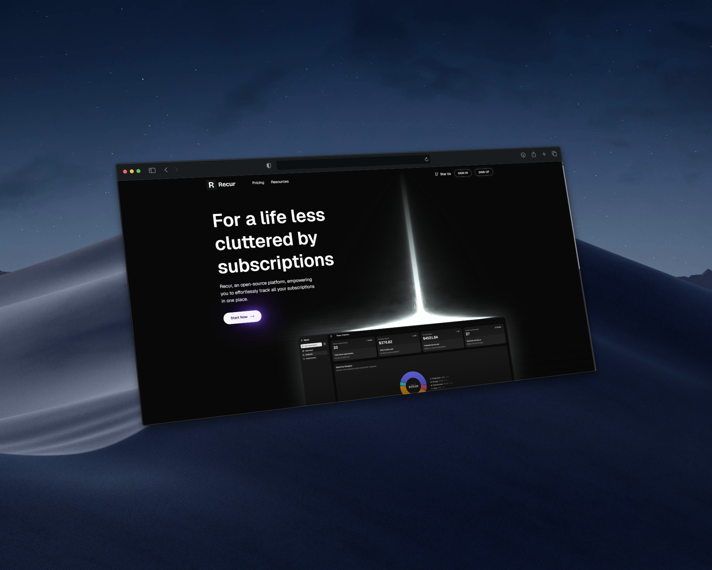
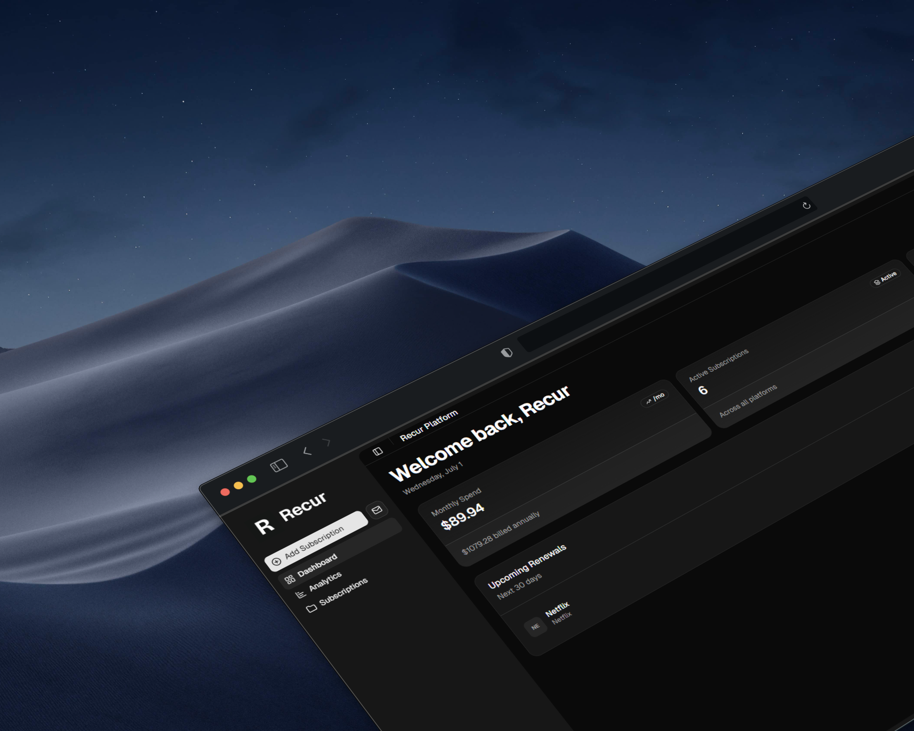
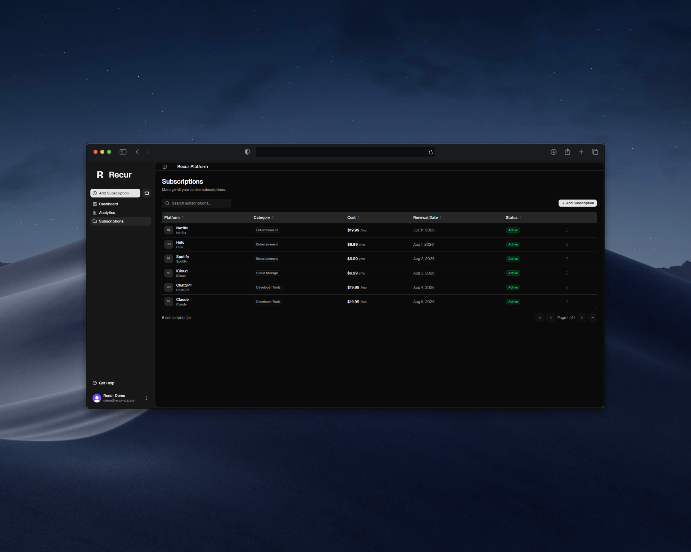
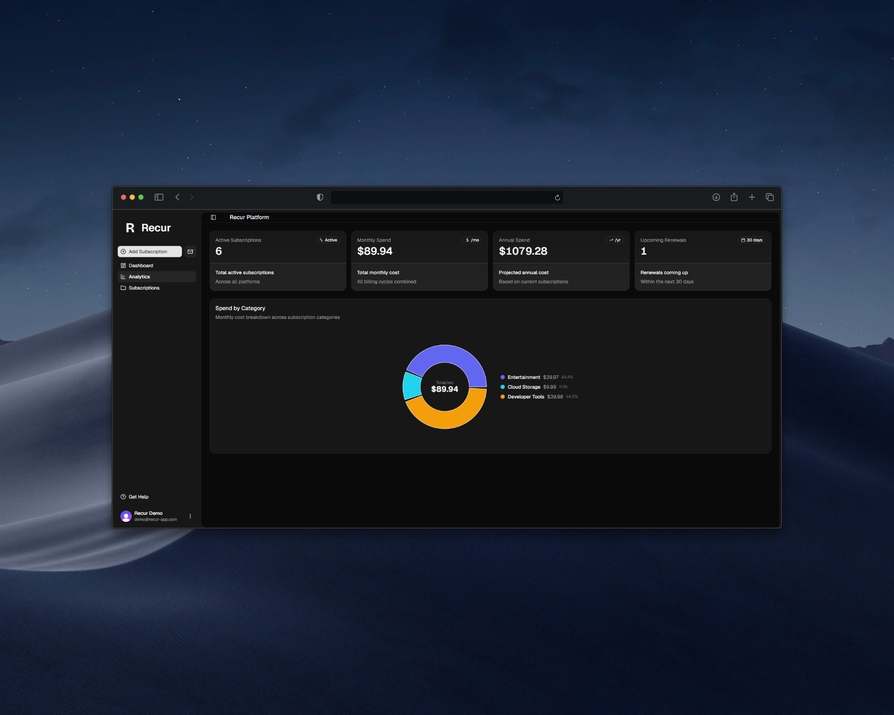
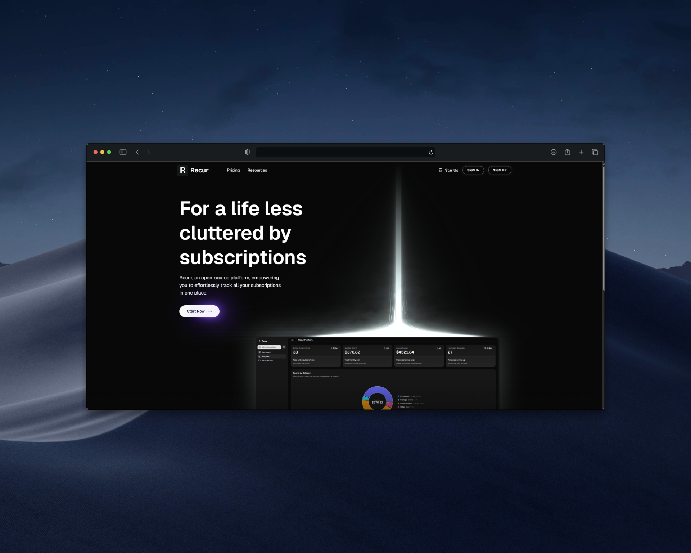

<div align="center">

#  Recur

A subscription tracker that keeps tabs on your recurring costs and reminds you before anything renews.

[](https://recur-app.com)



</div>

## About

Recur tracks recurring payments in one place. Add a subscription with its cost, billing cycle, and renewal date, and Recur totals your monthly and yearly spend, breaks it down by category, and sends an email reminder ahead of each renewal. Renewal dates advance automatically each cycle, and every reminder that goes out is kept in a history view.

The frontend is React and Vite with Tailwind and shadcn/ui. The backend is FastAPI with MongoDB, Clerk for authentication, and Resend for email. Both run in Docker and deploy to EC2 through GitHub Actions.

## Screenshots

| Dashboard | Subscriptions |
|---|---|
|  |  |

| Analytics | Home |
|---|---|
|  |  |

## Setup

Requires Docker, a MongoDB connection string, and a Clerk application. A Resend API key is optional; email reminders are skipped without one.

1. Copy `server/.env.example` to `server/.env` and fill in your values.
2. Copy `client/.env.example` to `client/.env` and add your Clerk publishable key.
3. Build and run:

```bash
VITE_CLERK_PUBLISHABLE_KEY=pk_xxx VITE_API_URL="" docker-compose -f docker-compose.dev.yaml up --build
```

The app runs at http://localhost and the API at http://localhost:8000.

## Deployment

Pushing to `main` builds the server and client images, pushes them to AWS ECR, and deploys to EC2 over SSH. In production, nginx serves the frontend, proxies API requests, and terminates HTTPS with a Let's Encrypt certificate.
